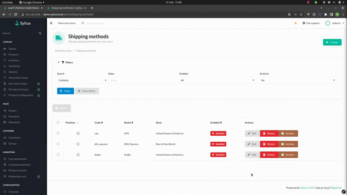

<h1 align="center">Asdoria Sylius Shipping Delivery Time Plugin</h1>

<div align="center">

[![Latest Version][ico-version]][link-packagist]
[![Latest Unstable Version][ico-unstable-version]][link-packagist]
[![Software License][ico-license]](LICENSE)
[![Build Status][ico-github-actions]][link-github-actions]
[![Code Coverage][ico-code-coverage]][link-code-coverage]

</div>

<div style="max-width: max-content; height: auto; margin: auto">



</div>

## Installation

### Add to composer.json

```json
{
    // ...
    "repositories": [
        // ...
        {
            "type": "github",
            "url": "https://github.com/asdoria/AsdoriaSyliusShippingDeliveryTimePlugin"
        }
    ]
}
```

### Require plugin with composer:

```bash
$ composer require asdoria/sylius-shipping-delivery-time-plugin
```

### Import configuration:

```yaml
# config/packages/asdoria_shipping_delivery_time.yaml
imports:
    - { resource: "@AsdoriaSyliusShippingDeliveryTimePlugin/Resources/config/app/config.yaml" }

    # Uncomment next line if you're using Webpack Encore
    # - { resource: "@AsdoriaSyliusShippingDeliveryTimePlugin/Resources/config/app/config_webpack.yaml" }
    
    # You can also import example fixtures to play
    # - { resource: "@AsdoriaSyliusShippingDeliveryTimePlugin/Resources/config/app/fixtures.yaml" }
```

### Import routing:

```yaml
# config/routes/asdoria_shipping_delivery_time.yaml
asdoria_sylius_shipping_delivery_time:
    resource: "@AsdoriaSyliusShippingDeliveryTimePlugin/Resources/config/routes.yaml"
```

or if your app doesn't use locales:

```yaml
# config/routes.yaml
asdoria_sylius_shipping_delivery_time:
    resource: "@AsdoriaSyliusShippingDeliveryTimePlugin/Resources/config/routes_no_locale.yaml"

```

### Override ShippingMethod Entity

Make `App\Entity\Shipping\ShippingMethod` extend `ShippingMethodCountdownAwareInterface`
```php
use Asdoria\SyliusShippingDeliveryTimePlugin\Traits\Aware\ShippingMethodCountdownAwareTrait;
use Asdoria\SyliusShippingDeliveryTimePlugin\Model\Aware\ShippingMethodCountdownAwareInterface;

/**
* Class ShippingMethod
 *
 * @author Philippe Vesin <pve.asdoria@gmail.com>
 */
class ShippingMethod extends BaseShippingMethod implements ShippingMethodCountdownAwareInterface
{
    use ShippingMethodCountdownAwareTrait;
    
    /**
     * ShippingMethod constructor.
     */
    public function __construct()
    {
        parent::__construct();
        $this->initializeShippingSchedulesCollection();
    }
}
```

Make `src/Resources/config/doctrine/Shipping/ShippingMethod.orm.xml`
```xml
<mapped-superclass name="App\Entity\Shipping\ShippingMethod" table="sylius_shipping_method">
    <field name="deliveryWeekdays" column="delivery_weekdays" nullable="true" type="array"/>
    <field name="deliveryMaxTime" column="delivery_max_time" nullable="true" type="integer">
        <options>
            <option name="default">0</option>
        </options>
    </field>
    <field name="deliveryMinTime" column="delivery_min_time" nullable="true" type="integer">
        <options>
            <option name="default">0</option>
        </options>
    </field>
    <one-to-many target-entity="Asdoria\SyliusShippingDeliveryTimePlugin\Model\ShippingScheduleInterface"
                 mapped-by="shippingMethod" field="shippingSchedules" orphan-removal="true"
    >
        <cascade>
            <cascade-all/>
        </cascade>
    </one-to-many>
    <field name="additionalDeliveryTime" column="additional_delivery_time" nullable="true" type="json" />
</mapped-superclass>
```
### Override Product Entity


Make `App\Entity\Product\Product` extend `ProductCountdownAwareInterface`
```php
use Asdoria\SyliusShippingDeliveryTimePlugin\Model\Aware\ProductCountdownAwareInterface;
use Asdoria\SyliusShippingDeliveryTimePlugin\Traits\Aware\ProductCountdownAwareTrait;

/**
 * Class Product
 * @package App\Entity\Product
 *
 * @author  Philippe Vesin <pve.asdoria@gmail.com>
 */
class Product extends BaseProduct implements ProductInterface, ProductCountdownAwareInterface
{
    use ProductCountdownAwareTrait;
}
```

Make `src/Resources/config/doctrine/Product/Product.orm.xml`
```xml
<mapped-superclass name="App\Entity\Product\Product" table="sylius_product">
    <field name="additionalDeliveryTime" column="additional_delivery_time" nullable="true" type="integer">
        <options>
            <option name="default">0</option>
        </options>
    </field>
</mapped-superclass>
```

### Override Channel Entity


Make `App\Entity\Channel\Channel` extend `DefaultShippingZoneAwareInterface`
```php
use Asdoria\SyliusShippingDeliveryTimePlugin\Model\Aware\DefaultShippingZoneAwareInterface;
use Asdoria\SyliusShippingDeliveryTimePlugin\Traits\Aware\DefaultShippingZoneAwareTrait;

class Channel extends BaseChannel implements ChannelInterface, DefaultShippingZoneAwareInterface
{
    use DefaultShippingZoneAwareTrait;
}
```

Make `src/Resources/config/doctrine/Channel/Channel.orm.xml`
```xml
<mapped-superclass name="App\Entity\Channel\Channel" table="sylius_channel">
    <many-to-one field="defaultShippingZone" target-entity="Sylius\Component\Addressing\Model\ZoneInterface"/>
</mapped-superclass>
```

### Add plugin class to your `bundles.php`:

```php
<?php
$bundles = [
    // ...
    Asdoria\SyliusShippingDeliveryTimePlugin\AsdoriaSyliusShippingDeliveryTimePlugin::class => ['all' => true],
    // ...
];
```
* Copy the template overrides from the plugin directory
```
From: [shop_dir] vendor/asdoria/sylius-shipping-delivery-time-plugin/Resources/views/bundles/SyliusAdminBundle/*
To: [shop_dir] templates/bundles/SyliusAdminBundle/*
```

### Update your database:

```bash
bin/console doctrine:migrations:diff
bin/console doctrine:migrations:migrate
```

### Install assets:

```bash
php bin/console assets:install
```

### Clear cache:

```bash
php bin/console cache:clear
```

### If the date format doesn't correspond to the locale on server, add package `icu-data-full`

[ico-version]: https://poser.pugx.org/asdoria/sylius-shipping-delivery-time-plugin/v/stable
[ico-unstable-version]: https://poser.pugx.org/asdoria/sylius-shipping-delivery-time-plugin/v/unstable
[ico-license]: https://poser.pugx.org/asdoria/sylius-shipping-delivery-time-plugin/license
[ico-github-actions]: https://github.com/Setono/SyliusShippingDeliveryTimePlugin/workflows/build/badge.svg
[ico-code-coverage]: https://codecov.io/gh/Setono/SyliusShippingDeliveryTimePlugin/branch/master/graph/badge.svg

[link-packagist]: https://packagist.org/packages/asdoria/sylius-shipping-delivery-time-plugin
[link-github-actions]: https://github.com/Setono/SyliusShippingDeliveryTimePlugin/actions
[link-code-coverage]: https://codecov.io/gh/Setono/SyliusShippingDeliveryTimePlugin
